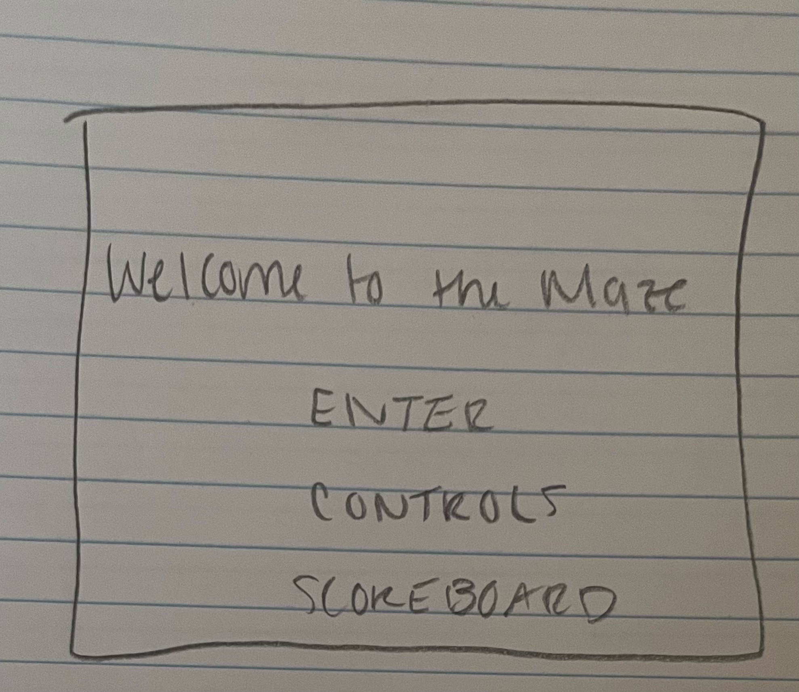
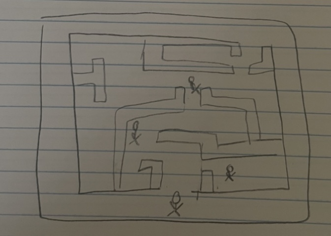
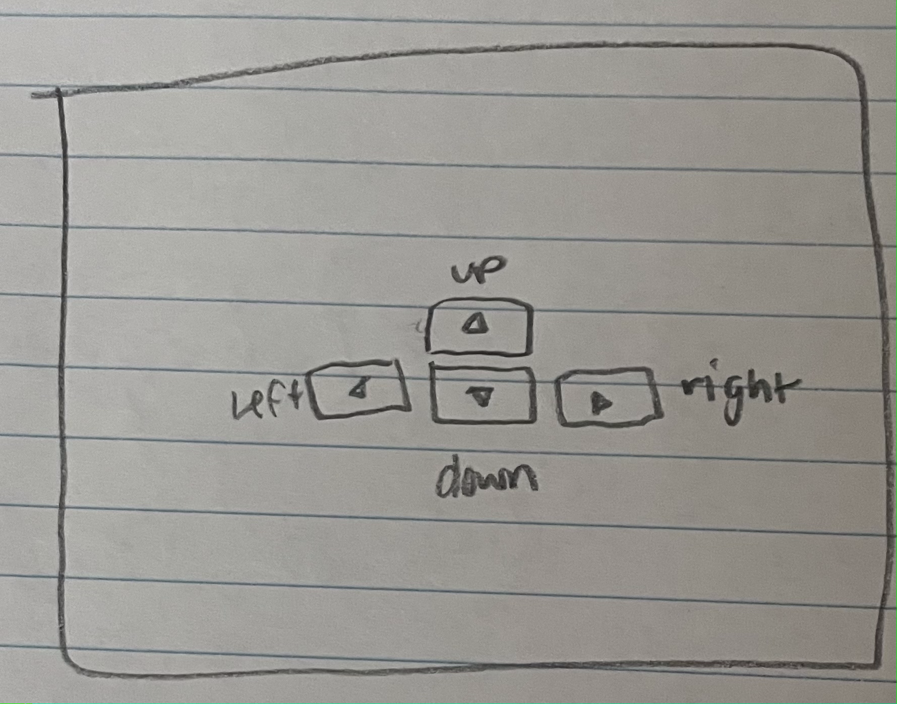
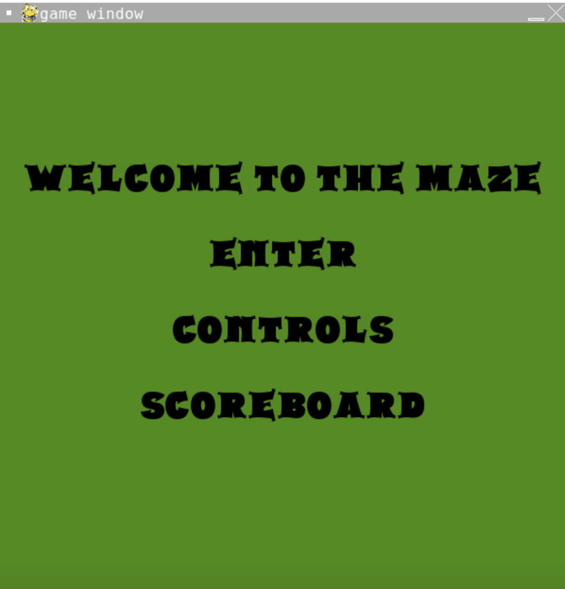
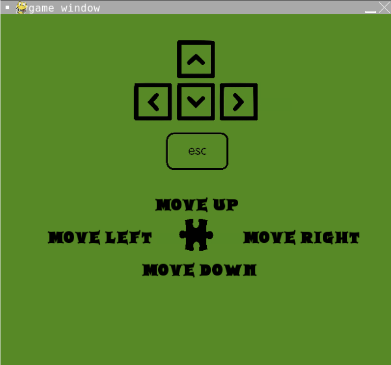
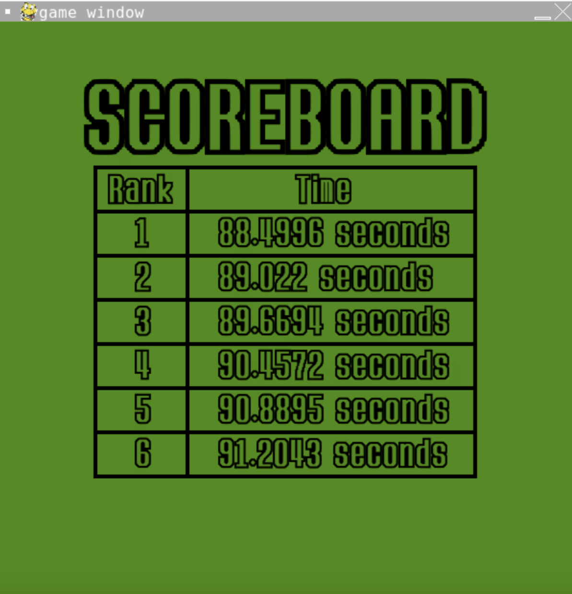
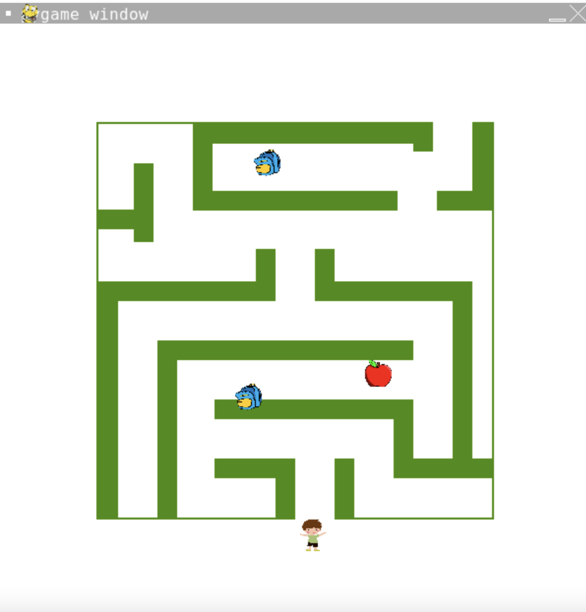
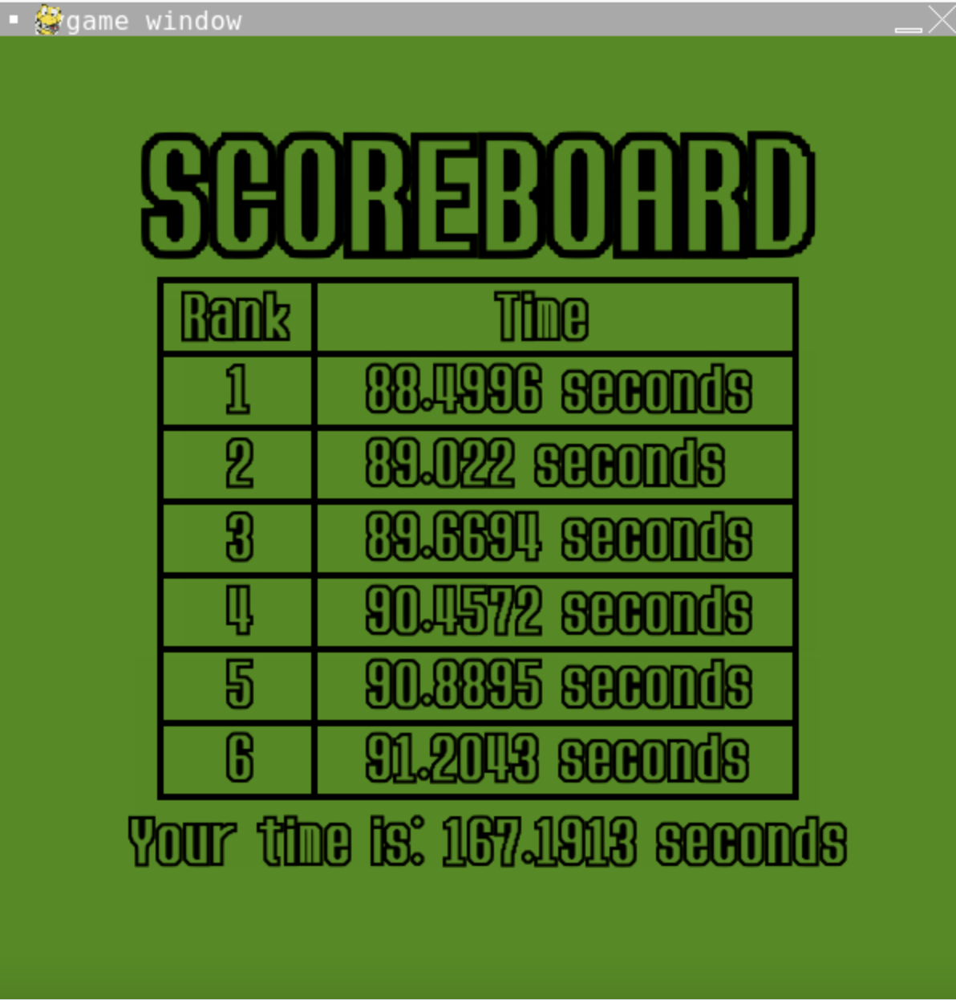
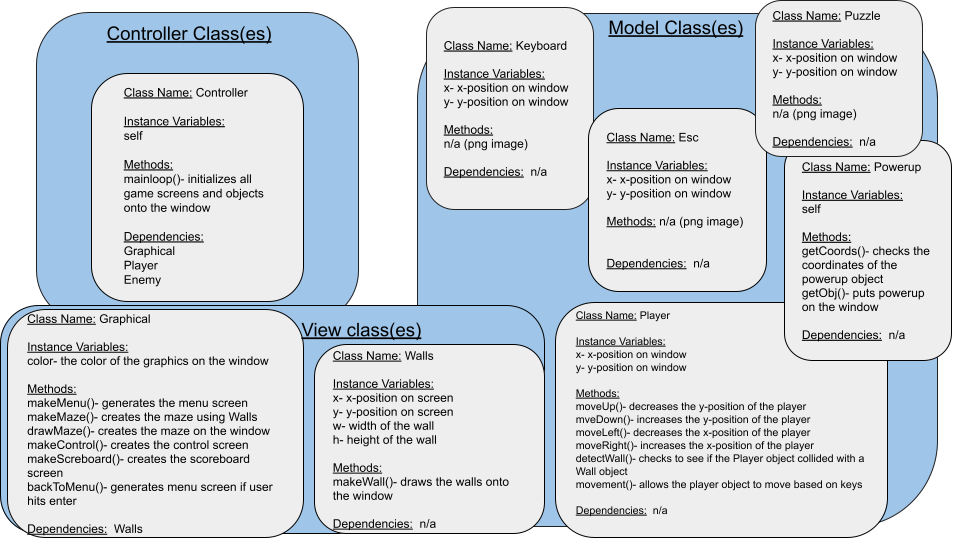

:warning: Everything between << >> needs to be replaced (remove << >> after replacing)
# CS110 Project Proposal
# School is a Maze 
## CS 110 Final Project
### Fall, 2022 
### [Assignment Description](https://docs.google.com/document/d/1H4R6yLL7som1lglyXWZ04RvTp_RvRFCCBn6sqv-82ps/edit?usp=sharing)

https://replit.com/join/oiweiazppp-jackhunter9 

[Presentation Slides](https://docs.google.com/presentation/d/1rDUOnalMx9VGvmmdmZGzVPruuD_RRKa3Ap9rmwXWC5I/edit?usp=sharing)

### Team: Green 
#### Jack Hunter & Lily Thorne 

***

## Project Description

Navigate your way through a maze as a student as fast as you can and try to avoid or defeat professors blocking your way!

***    

## User Interface Design

- **Initial Concept**
  -  
  - 
  -  
    
    
- **Final GUI**
  - 
  - 
  - 
  - 
  - 
  - 

***        

## Program Design

* Non-Standard libraries
    *Pygame
      -https://www.pygame.org/
      - Pygame is a module for Python that helps you create games and other multimedia applications

    *
  
* Class Interface Design
    * 
        *  
* Classes

1. < Class Player > 
    * __init__
        * < Initializes the player object with characteristics: xpos ypos >
    * moveRight
        * < Allows the player to move in the right direction >
    * moveLeft
        * < Allows the player to move in the left direction >
    * moveUp
        * < Allows the player to move upwards >
    * moveDown
        * < Allows the player to move down >
    * detectWall
        * < Checks to see if the Player object collided with a Wall object >
    * movement
        * < Allows the player object to move based on keys >

2. < Class Controller >
   * __init__
       * < Initializes the Controller object>
    * mainloop
        * < Runs the game >

   
        
3.  < Class Powerup > 
    * __init__
        * < Initializes the powerup object >
    * getCoords
        * < Checks the coordinates of the powerup object compared to Walls>
    * getObj
        * < Puts the powerup object on the window   >

4.  < Class Walls > 
    * __init__
        * < Initializes the Wall object with characteristics:  xpos ypos height and width>
    * makeWall
        * < Makes a wall object on the screen>

5. < Class Graphical > 
    * __init__
        * < Initializes the graphical object with characteristic: color >
    * makeMenu
        * <generates the menu screen>
    * makeMaze
        * <creates the maze using Walls>
    * drawMaze
        * <creates the maze on the window>
    * makeControls
        * <creates the control screen on the window>
    
6.  < Class Keyboard > 
    * __init__
        * < Initializes the Keyboard object with characteristics:  xpos ypos >

7. < Class Database >
   * __init__
       * < Initializes the database object >
    * addData
        * < saves data into the repl database >
        
8. < Class puzzle >
   * __init__
        * < Initializes the Puzzle object with characteristics:  xpos ypos >
   

       
## Project Structure and File List

The Project is broken down into the following file structure:

* main.py
* src
    * controller.py
    * database.py
    * graphical.py
    * keyboard.py
    * player.py
    * powerup.py
    * puzzle.py
    * walls.py
    * esc.py
* assets
    * class_diagram.jpg
    * apple.png
    * backpack.png
    * calculator.png
    * pencil.png
    * student.png
    * keyboard.png
    * concept_sketches (FOLDER)
      * controls_sketch.png
      * maze_sketch.png
      * menu_sketch.png
    * GUI_screens (FOLDER)
      * controls_screen.png
      * maze_screen.png
      * menu_screen.png
      * scoreboard_screen.png
      * scoreboard_screen_end.png
* etc
    * milestone2.md

***

## Tasks and Responsibilities 

   * Jack-
     * Database
     * Player
     * Graphical
   * Lily-
     * Walls
   * Collaborative
     * Powerup
     * Controller
   

## Testing

* We would test the program by writing bits of code as testing and debugging as we went

## ATP

| Step                 |Procedure             |Expected Results                   |
|----------------------|:--------------------:|----------------------------------:|
|  1                   | Navigate to Shell, type "python3 main.py" and hit enter  |Game window opens to screen that reads "Welcome to the Maze", "Enter", "Control", and "Scoreboard" |
|  2                   | click "Control"      | displays control screen with     directions on what keys to press to move the player                |
|  3                   |press esc button on screen   |window returns to menu screen|
|  4                   |click "Scoreboard"    |displays scoreboard screen with score rankings  |
|  5                   |click "Enter"         |displays maze screen and user can begin playing |
|  6                   |press up arrow key on keyboard   |player moves up 2px|
|  7                   |press down arrow key on keyboard   |player moves down 2px|
|  8                   |press left arrow key on keyboard   |player moves left 2px|
|  9                   |press right arrow key on keyboard   |player moves right 2px|
|  10                  |using arrow keys, navigate player to a powerup in the maze (backpack, calculator, or apple)  |when player reaches a powerup, the powerup disappears and player gains 5 points |
|  11                  |player is navigated to the end of the maze  |scoreboard screen is shown with time ranks and users score is  displayed under the scoreboard. if user makes it onto the scoreboard, their score will appear there as well  |
